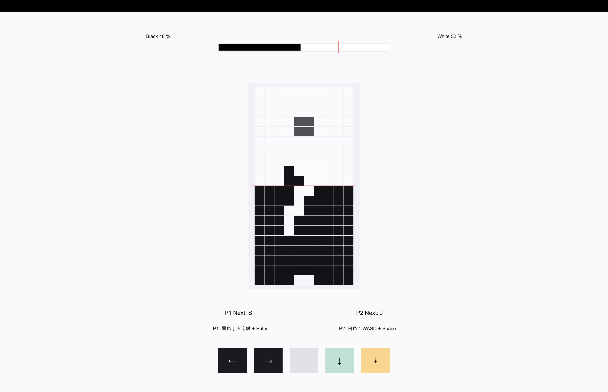

# Flip Blocks / 翻轉方塊

雙人領地爭奪：共用棋盤、推進方塊、切斷連結、翻轉顏色，率先佔領 70% 即獲勝。

## 立即遊玩

- **公開網站：** 部署完成後，用瀏覽器開啟 `https://<your-domain>/` 即可玩三種模式（含線上對戰）。請把佔位符換成你自己的網址，不要把實際網域寫進倉庫。
- **GitHub Pages 靜態版：** 設定 **Settings → Pages → Deploy from a branch → main → /docs** 後，網址為 `https://<owner>.github.io/<repo>/`。靜態版可玩**同機雙人**與**單人對戰 AI**；線上對戰需要連線主機。步驟見 [GitHub Pages 發佈說明](docs/github-pages.md)。
- **本機檔案：** 直接開啟 [`docs/index.html`](docs/index.html) 也能玩同機與 AI，不必安裝套件。



## 模式總覽

進入頁面先選一種方式：

| 模式 | 說明 |
| --- | --- |
| 同機雙人 | 兩人共用一台裝置。玩家一可選經典（方向鍵 + Enter）或替代（Z/X 旋轉、↑ 落定）方案，玩家二固定 WASD + Space，也支援觸控。 |
| 單人對戰 AI | 你操作玩家一，電腦操作玩家二。可選新手／簡單／普通／困難，上次難度會記住。新手與簡單會放慢玩家下落。 |
| 線上對戰 | 輸入暱稱後建立房間或加入房間，也可觀戰。支援多房間、匿名排行榜，以及斷線後回到原座位。 |

三種模式都有選色、下個方塊預覽、落點提示、音效、暫停與再戰；切換分頁或視窗會自動暫停。手機寬度可在棋盤上滑動手勢（左右移動、輕觸旋轉、快滑落定、慢拉加速）。

## 線上對戰

玩家只要開已部署的網址（或自架主機提供的頁面），不必填主機 IP。

1. 選「線上對戰」，輸入 2–12 字**暱稱**（會記住）。
2. 按「建立房間」得到 6 位**房間代碼**（大寫字母與數字，不含 0/O/1/I），複製代碼或「分享連結」（`?room=代碼`）給朋友。
3. 朋友開啟同一網站，輸入暱稱與房間代碼後按「加入房間」。知道代碼者也可「以觀戰加入」，只看狀態、不能操作。
4. 雙方按「我準備好了」，房主選色並開始。換色後需重新準備。

連線時方向鍵或 WASD 都控制自己，Enter / Space 落定。棋盤、勝負與暫停由主機同步。對局中斷線可在約 60 秒內回到**原房間原座位**；雙方離開後房間再保留一段時間供重連或再戰。連線對局會記入匿名**排行榜**（同暱稱累計勝場）；同機與 AI 不上傳。

帶 `?room=` 的連結只會預填代碼，輸入暱稱後再加入。協定、重連細節與排錯見 [線上對戰說明](docs/lan-play.md)。

## 自架主機

線上對戰需要一台執行本專案的連線主機。GitHub Pages 或直接開 HTML 不能當主機。

**用 Node.js（開發或臨時開房）：** 安裝 Node.js 22 以上，在專案根目錄執行：

```sh
npm install
npm start
```

然後開啟 `http://localhost:8787`。同一區域網路的朋友改連 `http://<主機位址>:8787`。連接埠被占用時可用 `PORT=9000 npm start`。

**用 Docker：** 依 [拉取式部署說明](docs/deploy.md) 啟動 `deploy/docker-compose.yml`。

環境變數從 [`.env.example`](.env.example) 複製成本機 `.env`（已列入 `.gitignore`），只填變數、不要把實際值提交進倉庫。常用項目：

- `DATA_DIR`：排行榜 SQLite 目錄（容器內通常掛到 `/app/data`）。
- `TRUST_PROXY`：直連、區域網路或 Tailscale 保持關閉；主機在 **Cloudflare Tunnel** 後方才開啟，改從 `CF-Connecting-IP` 取訪客 IP。
- `MAX_ROOMS`、`MAX_ROOMS_PER_IP` 等：房間與頻率上限，部署值可與倉庫預設不同。

進階「自架主機」欄位只在要連到**另一台**電腦上的主機時才需要填。

## 部署

推到 `main` 後，CI 會跑測試並把映像推到 GHCR；伺服器上的 Watchtower 再拉取更新。映像路徑、登入與排錯見 [拉取式部署說明](docs/deploy.md)。

## 開發

```sh
npm install
npm test
```

```text
.
├── .env.example              # 環境變數名稱與說明（不含值）
├── .gitignore
├── .gitattributes
├── .dockerignore
├── Dockerfile
├── README.md
├── package.json              # npm start / npm test
├── package-lock.json
├── pnpm-lock.yaml
├── main.lua                  # 原 Codea/Lua 原型
├── .github/workflows/publish.yml
├── FlipBlocksUnity/          # Unity 本機雙人版
│   ├── Assets/
│   ├── Packages/
│   ├── ProjectSettings/
│   └── README.md
├── docs/
│   ├── index.html            # 網頁遊戲入口
│   ├── style.css
│   ├── game-core.js          # 遊戲規則
│   ├── game.js               # 畫面、模式選擇與操作
│   ├── ai.js                 # 單人模式 AI
│   ├── network.js            # 連線、房間代碼與暱稱
│   ├── audio.js              # Web Audio 音效
│   ├── session-record.js     # 本場戰績
│   ├── lan-play.md           # 線上對戰說明
│   ├── deploy.md             # Docker / Watchtower
│   ├── github-pages.md       # 靜態網頁發佈
│   ├── favicon.svg
│   └── screenshots/
├── server/
│   ├── index.cjs             # HTTP / WebSocket 多房間主機
│   └── leaderboard.cjs       # SQLite 匿名排行榜
├── deploy/docker-compose.yml
└── tests/
    ├── game-core.test.cjs
    ├── ai.test.cjs
    ├── network.test.cjs
    ├── rooms.test.cjs
    ├── abuse.test.cjs
    └── session-record.test.cjs
```

## Unity 版

目前仍是同一台電腦的雙人操作，尚未做線上對戰。

1. 使用 Unity Hub 安裝 Unity **6000.4.10f1**（以 `FlipBlocksUnity/ProjectSettings/ProjectVersion.txt` 為準）。
2. 加入本儲存庫的 **`FlipBlocksUnity`** 子資料夾。
3. 開啟 `Assets/Scenes/Main.unity`，按 Play，選色後開始。

| 動作 | 玩家一 | 玩家二 |
| --- | --- | --- |
| 左右移動 | ← / → | A / D |
| 旋轉 | ↑ | W |
| 軟降 | ↓ | S |
| 硬降 | Enter | Space |

棋盤為 10 × 20，含 I/O/T/S/Z/J/L。方塊落定與包圍會翻色，任一顏色達到 70% 佔領即結束。網頁版規則與操作見 [GitHub Pages 發佈說明](docs/github-pages.md)。更多說明見 [`FlipBlocksUnity/README.md`](FlipBlocksUnity/README.md)。

macOS 建置入口為 `FlipBlocksUnity/Assets/Editor/BuildFlipBlocks.cs` 的 `BuildFlipBlocks.BuildMac`，輸出 `FlipBlocksUnityBuild/FlipBlocks.app`（已由 `.gitignore` 排除）。

請以**含本 README 的資料夾**作為 Git 根目錄。`Assets` 與其 `.meta`、`Packages`、`ProjectSettings` 需納入版本庫；Unity 快取與本機編輯器設定則排除。

## 致謝

本專案基於 xuan 的想法，由 [yuxzs](https://github.com/yuxzs) 所做的原作 Flip-Blocks（Codea/Lua 原型與 Unity 版）。

再由 [Lu-An Chen](https://github.com/luancs11) @ [NYCU-Police](https://github.com/NYCU-Police/Flip-Blocks) 接續開發及部署（網頁版、連線對戰、AI、排行榜、CI/CD）。
